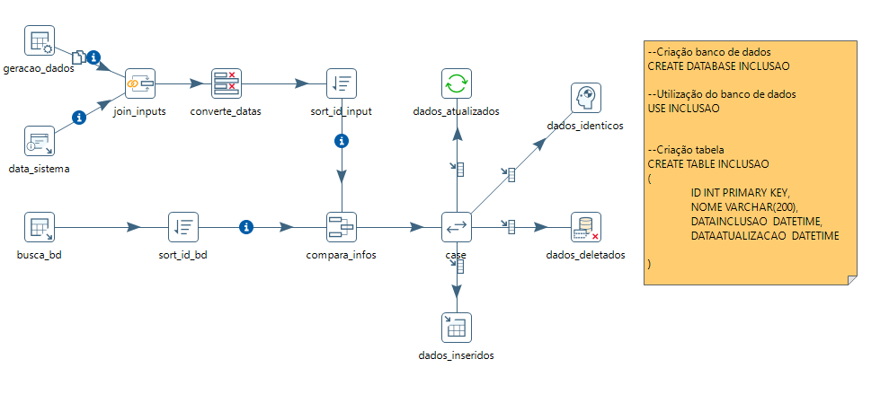
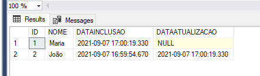

# PDI-Inserts-Updates-Deletes

Com essa transformação, torna-se possível realizar uma adaptação conforme necessidade/regra de negócio no qual pode-se buscar dados das mais variáveis localidades (APIs, Bancos de Dados, XML, Excel, entre outros) e realizar a inserção, atualização ou mesmo remoção dos dados em um banco de dados SQL.

Neste exemplo foi criada uma tabela INCLUSAO com as colunas ID, NOME, DATAINCLUSAO, DATAATUALIZACAO. A coluna ID é a chave desta tabela. Neste exemplo, a coluna NOME pode ser alterada e quando isso acontece, a coluna DATAATUALIZACAO é populada. Vale observar que o exemplo abaixo, conforme imagem poderia ser adaptado de modo que se o ID fosse deletado, um update poderia ser realizado uma coluna DATAREMOCAO, para manter o histórico de toda a operação.

Após a execução da transformação acima, espera-se o resultado abaixo. 

OBS 1: Os scripts SQL se encontram comentados na transformação do Pentaho.  
OBS 2: Foi utilizado o Pentaho Data Integration na versão 8.2.

